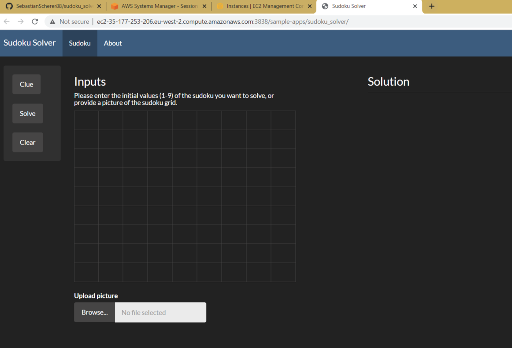
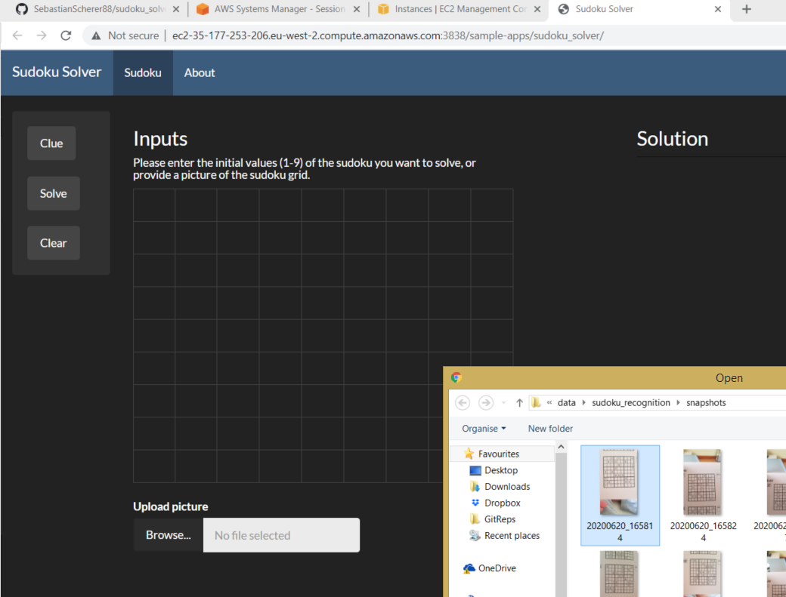
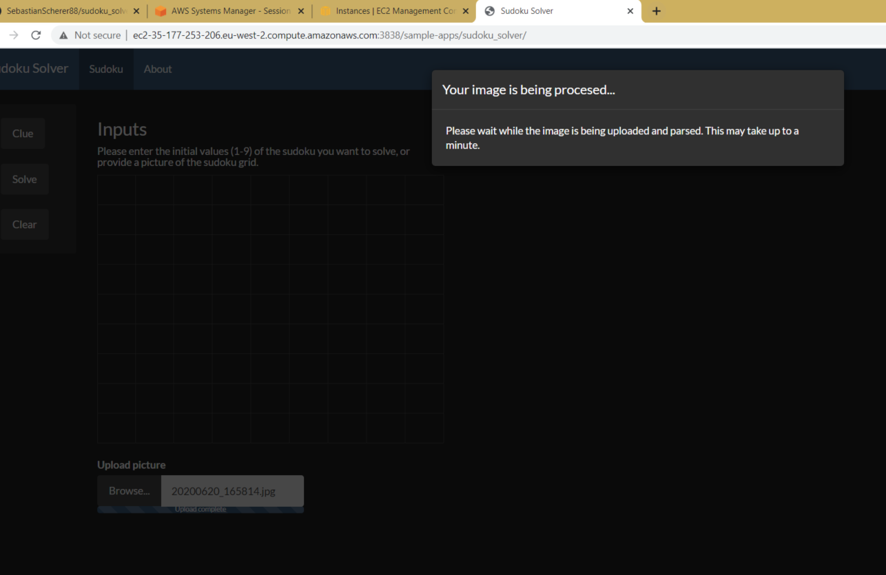
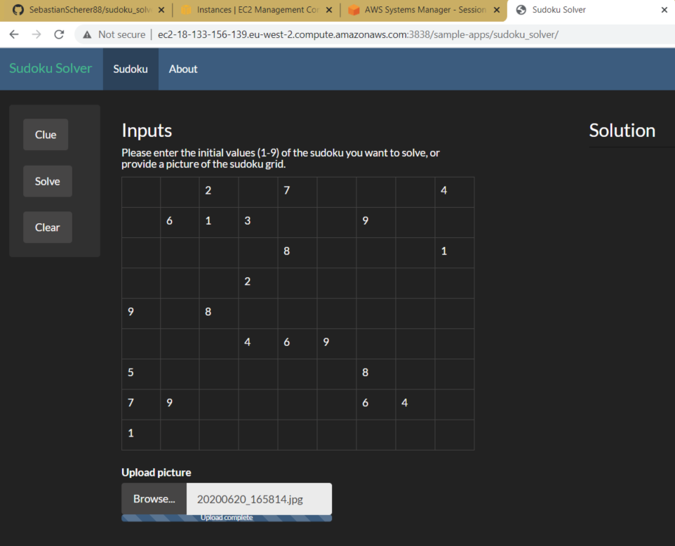
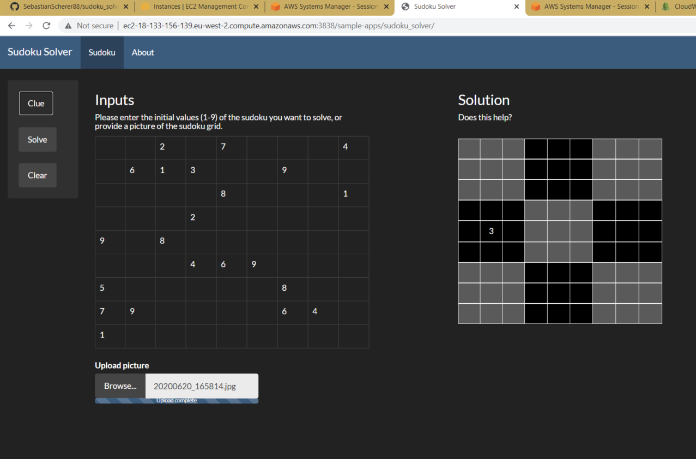
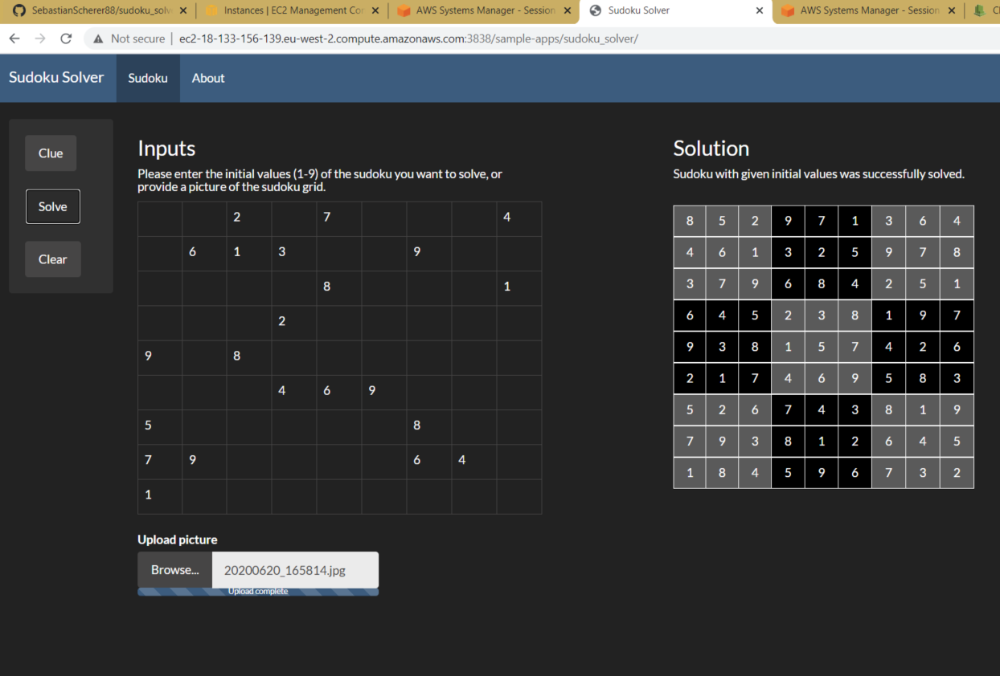

## What does this project do?

Hello there, and thanks for checking out this project!

This repo contains all the code (and some instructions on the hosting setup) for a [**remotely AWS hosted sudoku solving application**](http://aws.sudokusolver.cloud/app/) written in Python and R.

The updated version now also contains an image recognition module that allows the user to upload pictures of initial sudokus to the app.

To upload a picture of an initial sudoku, simply click the `Browse` button and 
- select a file if you are using a laptop device
- select a file or take a picture if you are using a smartphone device

The application will then try and parse the image to extract the initial values and use them to populate the sudoku grid.

If the image recognition works, the initial grid should show the initial values of sudoku you uploaded. It's worth double checking if all values got identified correctly.

That looks good. If it doesn't work for the pictures you upload, you can always manually enter the initial values directly into the grid.

Once you have the initial values, you can press the `Clue` button to get a random digit of the solution shown:

Of course, you can also solve the whole sudoku by pressing the `Solve ` button:

Both inputs and solution can be reset by clicking on the `Clear` button.

## But why?

The sudoku solving API is 

- designed to help people solve those tricky Sudoku's if they're stuck, but also
- is something I've been interested in doing for some time. 
	- I was intereted in rephrasing the Sudoku problem as a random mixed integer problem, to then use LP solver implementations
	- It was a great way to bring together and practice some modelling **and** deployment practices
		- out-of-the box image processing solutions usig the `cv2` library
		- some convolutional neural nets for image recognition
		- an intuitive, user friendly interface that works on most commonly used devices
		- making the entire application portable using Docker and Docker Compose
		- setting up the basic deployment infrastructure using EC2 instances on AWS
## Contents

Specifically, the repo contains the code for

- the R & RShiny frontend that the user interacts with
- the Python & FastAPI + pulp backend that solves a given sudoku (if possible)
- some experimental Python + tensorflow code, back when I was trying to add a sudoku image recognition step to the frontend - maybe I will add that later :)
- the Docker and Docker Compose image files and compose yaml

For a more detailed summary of the sources used to setup the AWS server, RStudio and Rshiny used for hosting, please have a look at [this file](./R/r_shiny_app/about.md).
