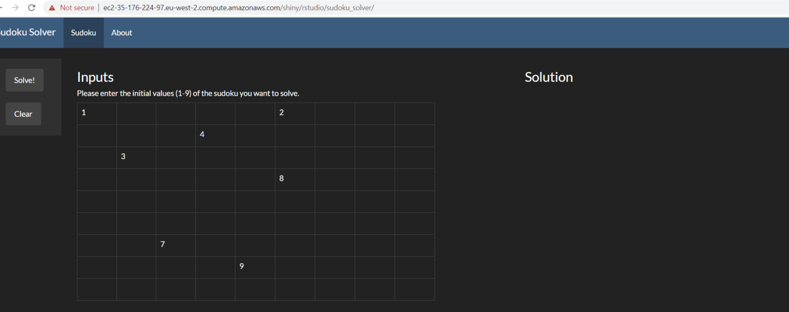
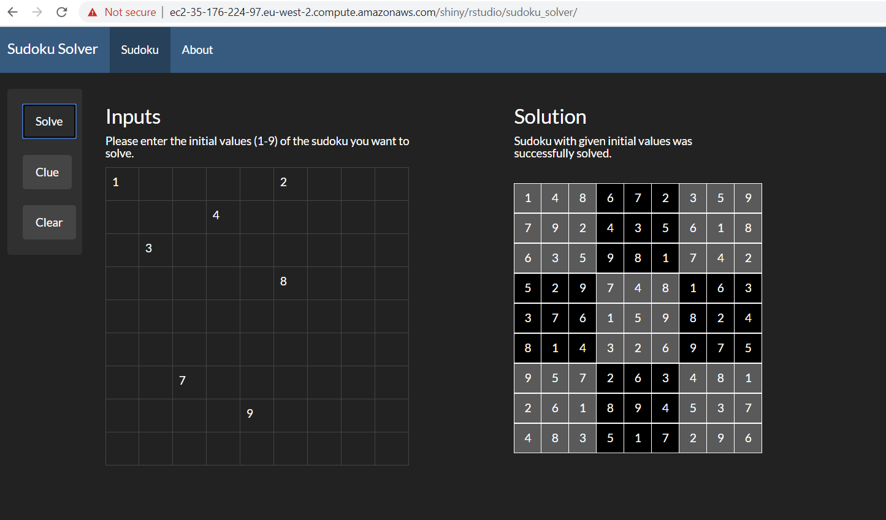

## What does this project do?

Hello there, and thanks for checking out this project!

This repo contains all the code (and some instructions on the hosting setup) for a remotely AWS hosted sudoku solving API written in Python and R.

It is exposed to a URL (which sadly changes everytime the AWS server restarts) which the user can then access via their webbrowser. The user will then see a GUI that allows him/her to input initial values of a the classic sudoku problem.

They can then get the solved sudoku printed back to them by clicking on the `Solve!` button:

Both inputs and solution can be reset by clicking on the `Clear` button.

## But why?

The sudoku solving API is 

- designed to help people solve those tricky Sudoku's if they're stuck, but also
- is something I've been interested in doing for some time. 
	- The idea of solving Sudoku's using a proven theoretical framework such as like mixed integer programming, together with the opportunity to get some practice in hosting technologies, was something I really wanted to get stuck in with.

## Contents

Specifically, the repo contains the code for

- the R & RShiny frontend that the user interacts with
- the Python & FastAPI + pulp backend that solves a given sudoku (if possible)
- some experimental Python + tensorflow code, back when I was trying to add a sudoku image recognition step to the frontend - maybe I will add that later :)

A more precise summary of the sources used to setup the AWS server, RStudio and Rshiny used for hosting, please have a look at [this file](./R/r_shiny_app/about.md).